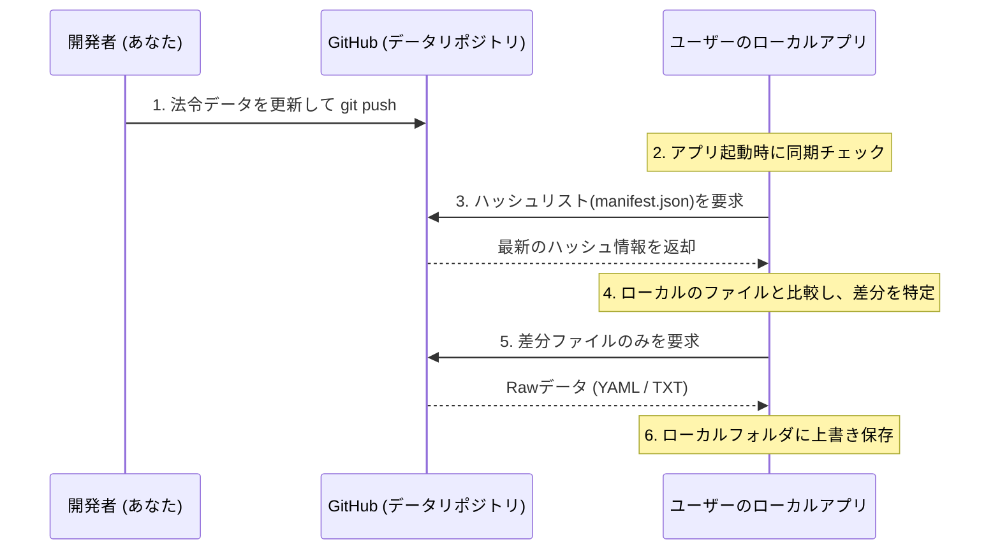

# GitHubを活用したデータ差分同期（アップデート）戦略

このドキュメントは、アプリ開発者がサーバー代（維持費）を一切負担せず、かつユーザーにも難しい設定をさせずに法令データの更新（法改正や法令の追加）を自動で行うための、持続可能なフリーソフト開発・配布戦略をまとめたものです。

---

## 概要（仕組み）

開発者が法令データを更新して **GitHubに `git push` するだけ**で、世界中のユーザーのローカルアプリが自動的に最新の差分データを検知して同期（ダウンロード）する仕組みです。



---

## 開発者（あなた）の運用フロー

設定さえ済ませておけば、法改正時のメンテナンスは以下のシンプルなコマンド操作のみで完結します。

1. **法令データの再取得とリンク再構築**
   ```bash
   # 例：建築基準法を再取得
   python scripts/fetch_egov_law.py --law-id 325AC0000000201 --slug building_standard_act
   
   # リンクグラフを再ビルド
   python scripts/build_link_graph.py
   ```
2. **配信用のマニフェスト（ハッシュリスト）自動生成**
   * 生成された全データファイル（`.yaml`, `.txt`）の相対パスとMD5ハッシュ値を記録した軽量なファイル（例: `manifest.json`）を生成するスクリプトを実行します。
3. **GitHubへのプッシュ**
   ```bash
   git add .
   git commit -m "Update dataset for Building Standard Act (2026-05-30)"
   git push origin main
   ```
   **これだけで配信完了です。アプリの再コンパイルやEXEの再ビルドは一切不要です。**

---

## アプリ側の差分検知・同期ロジック

ユーザーのアプリが起動した際、裏側で以下のステップを実行します。

1. **マニフェストファイルの取得**
   GitHubのRawアクセスURL（例: `https://raw.githubusercontent.com/[ユーザー名]/[リポジトリ名]/main/data/manifest.json`）から、最新のマニフェストファイルを読み込みます（数KB程度なので一瞬です）。
2. **ローカルデータとの比較**
   ローカルの `data/` フォルダ内のファイル一覧とハッシュを、ダウンロードしたマニフェストと比較します。
3. **差分ダウンロード**
   変更があったファイル（ハッシュが不一致）や新規追加されたファイルのみ、GitHubから個別ダウンロードしてローカルフォルダに直接保存（上書き）します。
4. **完了通知**
   ユーザーの邪魔にならない程度に「法令データを最新（〇年〇月〇日時点）に更新しました」と通知します。

---

## この方式のメリット

* **サーバー代が永久に0円**
  * GitHubがデータのホスティングと高速な配信（CDN）をすべて無料で肩代わりしてくれます。
* **ユーザーのインストール負担がゼロ**
  * 初回配布用のEXE（またはZIP）は小さく抑えられ、起動するだけでデータが自動で揃います。
* **データが「丸見え」でハックしやすい**
  * アプリ下の `data/` ディレクトリ配下にテキストやYAMLがそのまま保存されるため、昔のフリーソフトのように、ユーザー自身がファイルをエディタで直接開いて確認したり、微調整したりすることが可能です。
* **特商法の壁を回避**
  * 完全無料で配布し、アプリ内やGitHub上に「サポート（noteの投げ銭等）」のリンクを置くスタイルにすることで、個人情報をネットに公開する義務が発生しません。

---

## 今後の実装ロードマップ案

1. **マニフェスト自動生成スクリプトの作成**
   * `scripts/` 内に、`data/` 以下のファイルハッシュをまとめて `manifest.json` を書き出すスクリプト（`generate_manifest.py`）を作成する。
2. **アプリ側（PythonやRust/JS）の同期モジュールの実装**
   * 指定したURLから `manifest.json` をダウンロードし、ローカルのフォルダを走査して差分ダウンロードを行う関数を設計する。
